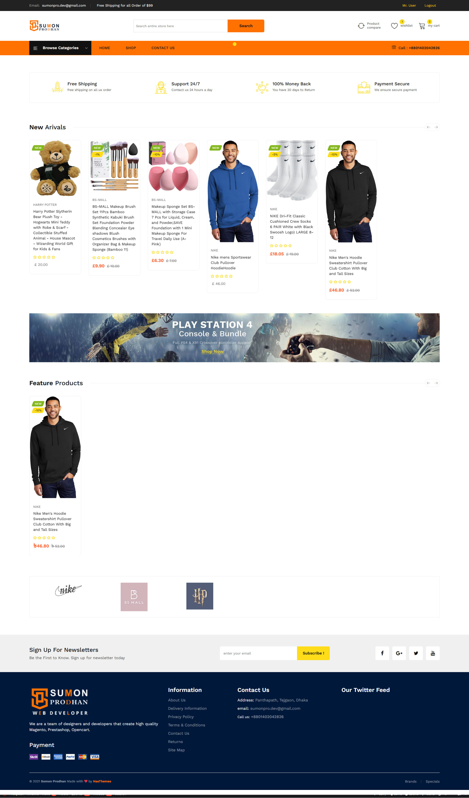

## 🌟 Overview

This e-commerce platform provides a modern and user-friendly online shopping experience. It allows customers to browse various products, add items to their cart, and securely complete the checkout process. The system also includes robust features for sellers and administrators to manage products and orders efficiently.

## ✨ Key Features

* **Product Management:**
    * Create, Read, Update, and Delete (CRUD) products.
    * Filter products by categories and tags.
    * Support for product variations (e.g., size, color).
* **User Authentication & Authorization:**
    * Secure user registration and login.
    * Role-Based Access Control (RBAC) for Admin and Customer roles.
* **Shopping Cart & Checkout:**
    * Intuitive shopping cart system.
    * Integration with multiple payment gateways (e.g., Stripe, PayPal - if applicable).
    * Order placement and tracking.
* **Order Management:**
    * Admin panel for viewing and updating order statuses.
    * Customer order history view.
* **Search and Filtering:**
    * Powerful product search engine.
    * Filtering based on price range, categories, brands, etc.
* **Responsive Design:**
    * Optimized User Interface (UI) for seamless experience across mobile, tablet, and desktop devices.

## 🚀 Technology Stack

This project is built using the following technologies:

* **Backend Framework:** Laravel (PHP)
* **Database:** MySQL 
* **Frontend:** HTML, CSS, Bootstrap, JavaScript, 
* **Key Packages/Libraries:**
    * [Example: Stripe SDK for payments]
    * [Example: Laravel-Permission for roles]
    * [List other critical packages]

## 🛠️ Setup and Installation

Follow these steps to get the project up and running on your local machine:

1.  **Clone the Repository:**
    ```bash
    git clone [https://github.com/sumonprodhan-dev/eCommerce_Project](https://github.com/sumonprodhan-dev/eCommerce_Project)
    cd your-repo-name
    ```

2.  **Install Dependencies:**
    ```bash
    composer install
    npm install # or yarn install, if you use yarn
    npm run dev # or npm run watch
    ```

3.  **Setup Environment File:**
    Copy the `.env.example` file to `.env`.
    ```bash
    cp .env.example .env
    ```
    Then, open the `.env` file and update your database credentials and other necessary settings.

4.  **Generate Application Key:**
    ```bash
    php artisan key:generate
    ```

5.  **Migrate and Seed Database:**
    ```bash
    php artisan migrate --seed # --seed is optional; adds demo data
    ```

6.  **Start Local Server:**
    ```bash
    php artisan serve
    ```
    The application will be accessible in your browser at `http://127.0.0.1:8000` (or the address displayed).

## 🖼️ Homepage Preview

A screenshot of the main homepage is provided below to give a quick visual overview of the design and layout:



---

## 🤝 Contributing

Contributions are welcome! If you would like to contribute, please fork the repository and submit a pull request.

## 📧 Contact

If you have any questions or feedback, feel free to reach out:
* **Name:** [Sumon Prodhan]
* **Email:** [sumonpro.dev@gmail.com]
* **LinkedIn:** [https://www.linkedin.com/in/sumonprodhan-dev/]